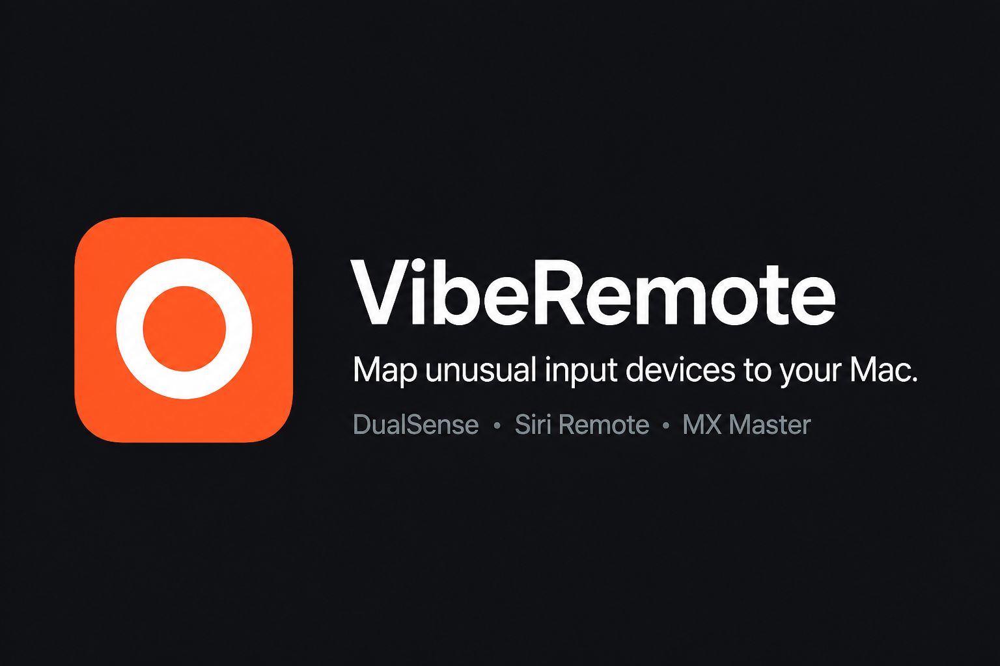

<p align="center">
  
</p>

<p align="center">
  <strong>Control Box</strong> is a local Mac control panel.<br>
  Displays, sound, pointer, windows, and a system monitor — plus DualSense, Siri Remote, and MX Master when you want them.
</p>

<p align="center">
  
</p>

It started as a mapper for unusual input. The Mac sidebar outgrew that: brightness and DDC, Night Shift warmth over the day, display-layout presets, per-app volume, pointer and wheel feel, grab-to-move windows, Dock window previews, and an optional menu-bar monitor. Controllers are still first-class. They are no longer the whole app.

Mac panes work with the built-in trackpad and any USB or Bluetooth mouse. Each attached controller has its own mappings and its own **Control this Mac** switch. Several can stay connected at once.

Control Box stays on your Mac. Nothing is uploaded.

## This Mac

| Pane | What you get |
|---|---|
| **Display Brightness** | Per-panel brightness (and contrast on supported externals). Optional one slider for all displays, which keeps each panel’s relative mix. Optional menu bar extra with those sliders. DDC/CI on Apple silicon from [MonitorControl](https://github.com/MonitorControl/MonitorControl). |
| **Night Shift** | f.lux-style 24-hour curve for system Night Shift yellowness. Off until you turn the pane on. Drag the curve; Apple’s sunset schedule is paused while Control Box is driving it. Optional follow dims or brightens external monitors with the curve (±10% by default). |
| **Display Arrangement** | Save and apply layout presets (positions, main display, mirror) for the screens that are plugged in now. Keyboard shortcut plus a layout HUD. |
| **Sound** | Output volume, then a per-app mixer. Optional menu bar extra with the same sliders. Needs System Audio Recording for per-app volume. |
| **System Monitor** | Optional second menu bar extra from [top](https://github.com/whitesticker/top): live network speed plus CPU, GPU, memory, disk, sensors, and battery. Off until you turn the pane on. Hide or quit that extra without quitting Control Box. |
| **Pointer & Scroll** | Pointer speed for USB and Bluetooth mice, wheel and thumb-wheel speed, smooth scrolling, natural vs standard direction. DualSense and Siri Remote keep their own sliders on the device page. |
| **Window Grab** | Hold a modifier chord and move to drag a window from anywhere; add Shift (by default) to resize with the top-left anchored. Optional throw snaps to a 3×3 map of the screen; optional organize (default Control-Command-O) tiles windows. Trackpad, any mouse, or DualSense. Accessibility must be on. |
| **Dock Previews** | Hover a Dock icon to see that app’s open windows and click one to bring it forward. Off until you turn the pane on. Live thumbnails need Screen Recording; titles work without it. |

## Devices

| Device | What you get |
|---|---|
| **DualSense / DualSense Edge** | Buttons, sticks, rumble. Touchpad **1-finger** and **2-finger** are separate Gestures. Sticks can be pointer or scroll; L2/R2 can switch tabs with analog travel. |
| **Siri Remote (A2540)** | Clickpad pointer, click-wheel scroll, face buttons, live calibration. |
| **MX Master 3 / 3S** | Extra buttons plus thumb **Gesture** (tap = click, hold + move = swipe). Isolated HID++ reader. |
| **MX Master 4** | Extra buttons including **Side**, **Haptic** pad, isolated HID++ reader. |

Wheel invert and scroll speed are shared across mice (one system scroll tap). Button and gesture mappings stay per device.

## Install

```bash
brew install --cask whitesticker/controlbox/controlbox
```

Open **Control Box**, then grant what you use in **System Settings → Privacy & Security**:

- **Accessibility** — keys, clicks, gestures, volume, Window Grab, Display Arrangement shortcut, Dock Previews
- **Input Monitoring** — mouse wheel speed and direction
- **Screen & System Audio Recording** — per-app volume on Sound (macOS 15 needs System Audio Recording, not Screen Recording alone). Dock Previews uses **Screen Recording** for live thumbnails; that is a different grant.
- **Allow in the Background** — keep mapping after the window closes, and start again after login

Relaunch if macOS asks. If you previously granted those to an older app identity, grant them again for Control Box.

The first launch of an ad-hoc Homebrew build may need **Right-click → Open**.

## Build from source

```bash
xcodebuild -project ControlBox.xcodeproj -scheme ControlBox -configuration Release \
  -derivedDataPath .derived build
open .derived/Build/Products/Release/ControlBox.app
```

Debug builds are signed with the Apple Development identity so Accessibility and Input Monitoring persist across rebuilds.

## Privacy

Control Box does not send input or audio to a server. Bluetooth is used only to list devices (it never calls `IOBluetoothDevice.pairedDevices()`). Accessibility posts the keyboard, pointer, and scroll events you mapped. System Audio Recording is used only for the per-app mixer on Sound.

## Roadmap

Tracked in [docs/roadmap.md](docs/roadmap.md):

- DualSense and Siri Remote **microphone**
- Stronger **gesture** hold / swipe on-screen cue (media skip / play / mute already show an action HUD)
- **MX keyboard** support
- More accurate **calibration** layouts
- Smoother **MX4 haptic** swipes (3S already feels better)
- First-run **onboarding**
- Menu bar icon: a **circle**, matching the app icon (not a game-controller glyph)
- **Background** (Allow in the Background) — request is in the Permissions pane; confirm after login
- **Per-app mouse profiles** — different Control mappings when the frontmost app changes

Generic mouse, Xbox, and other TV remotes are later. New hardware should land as a device family, not another special case in the host.

## Docs for contributors

Start at [docs/README.md](docs/README.md) and [AGENTS.md](AGENTS.md).
